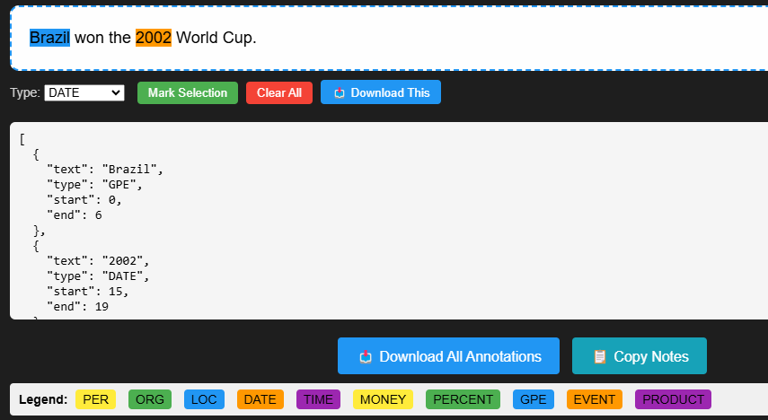

# NERNA (NER Notebook Annotation)

**NERNA** is a lightweight package designed for **Named Entity Recognition (NER) annotation** directly within Python notebooks.

Originally intended as a Streamlit-based interface, it has been reworked to run natively inside notebook environments (such as Jupyter, Google Colab, Databricks, etc.). This makes it easier to use without requiring deployment of web applications or cloud server contracts — ideal for occasional or exploratory use.

## Key Features

* ✅ Lightweight, interactive JavaScript interface embedded in notebooks
* ✅ Compatible with local notebooks and cloud platforms (e.g., Colab, Databricks)
* ✅ No need for external servers or deployments
* ⚠️ Annotations are made using **JavaScript**, so **they cannot be accessed directly as Python variables**. However, the input to the tool must be a **Python list of strings**.

---

## Usage Example

```python
from nerna import NERAnnotator

# List of texts to annotate
texts = [
    'Brazil won the 2002 World Cup.',
    'The planet’s drinking water is running out.'
]

# Initialize annotation
annotator = NERAnnotator(texts)

# Render the interactive annotation interface
annotator.render()
```


---

## Notes

* Annotated results are not automatically returned to Python. If you need to save or extract annotations, you’ll need to implement a custom mechanism to capture them.
* Ideal for manual review, small-scale labeling tasks, or quick experimentation in NLP workflows.

